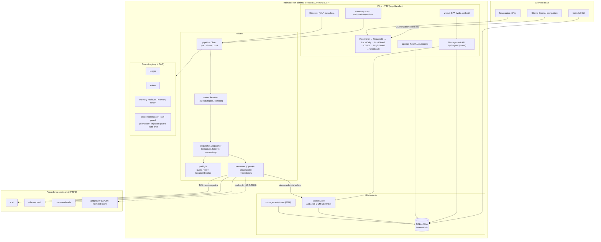

# Arquitetura — Heimdall-Core

Documento vivo. Descreve as camadas, os contratos do núcleo, a árvore real de
pacotes e o modelo de dados, refletindo o código do commit `4a68b7e`. Onde algo
existe como componente mas não está ligado no caminho de produção, isso está
dito explicitamente.

## 1. Visão de camadas

O núcleo é organizado em três faixas, com uma regra anti-ciclo rígida:

**Folhas (não importam nada interno):** `internal/domain` (tipos e `DomainError`
com `code` i18n), `internal/i18n` (catálogos embutidos + redator) e
`internal/contracts` (interfaces congeladas; importa só `domain`).

**Camadas de domínio (importam folhas, nunca `app`):** `config`, `store`,
`secret`, `providers`, `auth`, `executors`, `translators`, `egress`, `router`,
`quota`, `breaker`, `dispatcher`, `gates`, `pipeline`, `combos`, `gateway`,
`api/*`, `webui`, `observability`, `importers`, `obfuscate`, `passthrough`.

**Composition root:** `internal/app` — o **único** pacote que importa todos os
outros. Toda a fiação (vault, registry, gates, roteamento, HTTP) vive ali e em
nenhum outro lugar.

Regra prática: interfaces são definidas **pelo consumidor** e satisfeitas
estruturalmente. É por isso que `providers` não importa `router` (o
`providers.Catalog` satisfaz o port `router.ModelCatalog` por forma) e que
`dispatcher` não importa `providers` (o `app` faz o adaptador).

## 2. O pipeline

```
request → authz → GateChain.PreRequest → Router.Resolve(combo) → Dispatcher.Do
       → [Breaker/QuotaFilter] → Executor → GateChain.OnResponseChunk
       → GateChain.PostResponse → UsageRecorder
```

No código, o caminho de produção é o **gateway** (`internal/gateway`), que é
dono de `POST /v1/chat/completions`:

1. `chat` lê e limita o corpo (`MaxRequestBytes = 32 MiB`), extrai `model` e
   `stream` sem validar o resto (o corpo vai verbatim para preservar extensões
   do provedor).
2. Monta `GateInput` com **nomes de header apenas** e a identidade autenticada
   de cliente (`ClientKeyFromContext`); o corpo só entra se algum gate declarar
   que o consome (`Chain.ConsumesRequestBody`).
3. `GateChain.PreRequest` — pode `Continue`, `Modify` (reescreve o request),
   `Block` (devolve um `SyntheticResponse` como **resposta**, não erro) ou
   `Reroute` (recusado até o dispatcher de allowlist existir).
4. Detecta se `model` nomeia um combo; `Router.Resolve` produz um `RoutePlan`.
5. `Dispatcher.Do`/`DoStream` — dono do laço de tentativas/failover/accounting,
   consultando `Breaker` e `QuotaFilter` no preflight e reportando `Usage`.
6. `GateChain.OnResponseChunk` por chunk (pós-commit) e `PostResponse` ao fim.

**Outras rotas `/v1/*`** passam pelo `pipeline.Observer`, que roda só os
estágios de metadata (nunca lê corpo) e é a **cobertura catch-all** para uma
rota de inferência nova. O gateway e o observer **não duplicam** a passada: o
observer tem um `Skip` explícito para a rota do gateway (senão o rate-limiter
contaria a requisição duas vezes — o defeito que a F4 expôs).

> `pipeline.GatedExecutor` é um decorator que roda a cadeia em volta de um
> `Executor`. Ele existe, tem contrato e testes, mas **não é ligado no
> composition root na v1**: quem dirige a cadeia em produção é o gateway (e o
> observer para as demais rotas).

### Invariantes de streaming

- **Flag `committed`.** O primeiro byte downstream trava o vocabulário: depois
  dele só valem `ChunkPassThrough`/`ChunkReplace`/`ChunkDrop`. Reroute e troca
  de modelo pós-commit são violação de contrato.
- **Timeouts em camadas.** `ResponseHeaderTimeout` (TTFT; default 60 s) + idle
  entre chunks + deadline total. Nunca `http.Client.Timeout`, que mataria um
  stream legítimo.
- **Erro após `200 OK`.** Vira um frame SSE terminal `event: error` (com o
  `code` e `params` do `DomainError`), nunca um status HTTP — o `200` já foi
  enviado.
- **`[DONE]`.** O sentinel OpenAI é defensivamente rastreado (`doneRelayed`)
  para não emitir um segundo sentinel no EOF e quebrar clientes estritos.
- **Backpressure e cancelamento.** O `Stream` é *pull* (`Recv`) e está ligado ao
  `ctx` do `DoStream`; cancelar o contexto cancela o upstream.

## 3. Contratos do núcleo

Cada contrato congelado e seu arquivo:

| Contrato | Arquivo | Papel |
| --- | --- | --- |
| `Clock`, `IDGen`, `Redactor` | `contracts/contracts.go` | Serviços de apoio (tempo injetável, ids, redação). |
| `ProviderFamily`, `Credential`, `AuthMode`, `WireFormat`, `Capabilities`, `ModalitySet` | `contracts/identity.go` | Família (protocolo) ≠ credencial (conta). ADR-0001. |
| `AuthFlow` | `contracts/authflow.go` | Device code / PKCE / API key. |
| `Executor`, `Stream`, `Duplex`, `WireRequest`/`WireResponse`, `ExecutorDeps` | `contracts/executor.go` | Transporte + auth; invariantes de streaming. |
| `Translator` | `contracts/translator.go` | Tradução pura entre dialetos; pivô = OpenAI. |
| `Router`, `RoutePlan`, `StrategyKind`, `Candidate` | `contracts/router.go` | Resolução de rota e as 10 estratégias. |
| `Dispatcher` | `contracts/dispatcher.go` | Laço de tentativa/failover/accounting. |
| `QuotaFilter`, `UsageRecorder`, `Skip` | `contracts/quota.go` | Cota (preflight + observador; **não é gate**). |
| `Breaker`, `BreakerKey`, `BreakerState` | `contracts/breaker.go` | Máquina de estados por escopo. |
| `Gate`, `Decision`, `ChunkDecision`, `GateStage`, `FailurePolicy`, `SyntheticResponse` | `contracts/gate.go` | **Contrato congelado** do pipeline. |
| `Declared`, `DataField`, `GateDeclarer`, `Derived` | `contracts/gate_graph.go` | Vocabulário do grafo de dependência (ADR-0014). |
| `BodyConsumer` | `contracts/gate_body.go` | "Preciso do corpo" explícito (ADR-SEC-03 §2). |
| `CredentialStore`, `SecretStore` | `contracts/credential_store.go` | Cofre e persistência de credencial. |
| `MemoryRecord`, `MemoryHit`, `Embedder`, `AsyncSink` | `contracts/memory.go` | Memória e escrita assíncrona. |
| `ProviderDescriptor`, `Obfuscation` | `contracts/*` | Descriptor estático e camada de ocultação. |

O contrato `Gate` é deliberadamente **implementation-agnostic**: nenhum tipo
Go nativo cruza a fronteira (bytes, strings, mapas), para não bloquear um
adaptador WASM pós-v1.

## 4. Ordem HTTP (guardas)

`app.Handler()` monta a pilha de fora para dentro. A ordem é contrato de
segurança (ADR-SEC-06):

```
Recoverer → RequestID → LocalOnly(catch-all) → HostGuard → CORS
→ OriginGuard → ClientAuth → Observer → ErrorEnvelope → mux
```

- `Recoverer`/`RequestID` — panics e `X-Request-ID`.
- `LocalOnly` — recusa bind/caller não-loopback; **embrulha o mux inteiro**, então
  rota nova nasce protegida.
- `HostGuard` — anti-DNS-rebinding, validando `Host`.
- `CORS`/`OriginGuard` — CORS fechado e anti-CSRF (`Origin`/`Referer`).
- `ClientAuth` — chave de cliente em `/v1/*` (rota mutante); `/v1/models` é
  pública. Roda **antes** do observer para o `ClientID` já estar no contexto.
- `Observer` — estágio de metadata da cadeia sobre `/v1/*`.
- `ErrorEnvelope` — reescreve o 404/405 do mux no envelope i18n JSON.

## 5. Árvore de pacotes (real)

```
cmd/heimdall/main.go
internal/
  domain/          tipos + DomainError (code i18n)         [folha]
  i18n/            catálogos embed + redator + negociação  [folha]
  contracts/       interfaces congeladas                   [folha, importa domain]
  config/          TOML, precedência, provenance, validação
  store/           SQLite WAL (2 pools), migrações, stores
    migrations/    0001_init .. 0006_client_keys
  secret/          custódia da KEK, envelope AES-256-GCM, KDF Argon2id
  providers/       registry + famílias declarativas (OpenAICompat, CloudCode)
  auth/            flows (device_code, pkce, apikey), descriptors
    oauth/         pkce (loopback efêmero), device_code, antigravity (post-exchange)
  executors/       transporte+auth por dialeto; cloudcode/ (Antigravity)
  translators/     OpenAI↔Anthropic↔Gemini (puro, golden files)
  egress/          política de SSRF/TLS/redirect (ADR-SEC-05)
  router/          resolução, 10 estratégias, cursor, expansão de combo
  quota/           filter (preflight) + recorder (observador)
  breaker/         circuit breaker por escopo (in-memory)
  dispatcher/      tentativas, failover, accounting, stream
  gates/           engine: registry, DAG, Kahn; logger
    token/         engines de compressão + prefix-freeze
    memory/        retriever (pre) + writer (post) + embedder
    security/      maskers, injection, ssrf, rate-limit
  pipeline/        Chain (pre/chunk/post), observer, gated_executor
  combos/          DAG nomeado: validação, profundidade, capability
  gateway/         handler POST /v1/chat/completions
  passthrough/     rota legada (só sem gateway)
  api/
    openai/        /health, /v1/models (envelope OpenAI)
    mgmt/          /api/mgmt/* (status, providers, creds, combos, quotas, gates, uso, tokens, chaves)
    middleware/    Recoverer, RequestID, LocalOnly, HostGuard, CORS, OriginGuard, ClientAuth, ErrorEnvelope
  webui/           SPA Svelte embutida (/web/)
  observability/   logger estruturado + ClientID no contexto
  importers/       importação read-only de credenciais de harness
  obfuscate/       camada de ocultação por provedor (ADR-0003)
  app/             composition root; login.go: BeginLogin/Complete/LoginStatus/
                   RefreshProvider (single-flight) do `heimdall login`
web/               fonte Svelte 5 + Vite (builda para internal/webui/dist/)
scripts/           sbom-check.sh
```

## 6. Modelo de dados (SQLite + migrações)

Driver `modernc.org/sqlite` (Go puro, `CGO_ENABLED=0`). **Dois pools**: um
`*sql.DB` de escrita com `MaxOpenConns(1)` (serializa o escritor único do
SQLite) e um pool de leitura em WAL. `busy_timeout` em ambos absorve contenção
de um processo externo (a CLI) que o pool não serializa.

| Migração | Tabela | Conteúdo |
| --- | --- | --- |
| `0001_init` | `meta` | Chave/valor: `schema_version`, hash do token de gestão. |
| `0002_credentials` | `credentials` | Cofre: `secret_blob` guarda só o envelope `enc:v1:`. Índice por provider. |
| `0003_combos` | `combos` | Combo nomeado: `policy`, `body` (JSON), `depth` derivada, `schema_ver`. |
| `0004_quota` | `quota_windows`, `usage_attempts` | Cota durável por (credencial, janela) e log idempotente por `attempt_key`. |
| `0005_memory` | `memories`, `memories_fts` | Memória com namespace obrigatório, TTL, `content_hash` único; FTS5 lexical. |
| `0006_client_keys` | `client_keys` | Chaves de cliente: `key_hash` único, `revoked_at` (soft delete). |

O que **não** está no banco, de propósito: o **breaker** é in-memory (um
restart reabre circuitos transitórios); o **cursor de rotação** de combos é
estado de execução que reinicia com o processo; e **combos/credenciais/modelos
não são config** — são dados do operador que mudam em runtime.

## 7. Diagrama de containers



## 8. Fronteiras e leitura adicional

- Fronteiras de confiança, ativos e ameaças: [`THREAT-MODEL.md`](THREAT-MODEL.md).
- Catálogo de provedores e como adicionar: [`PROVIDERS.md`](PROVIDERS.md).
- Catálogo de gates e como escrever um: [`GATES.md`](GATES.md).
- Subset OpenAI suportado: [`openai-compat.md`](openai-compat.md).
- Decisões normativas: [`adr/`](adr/README.md).
